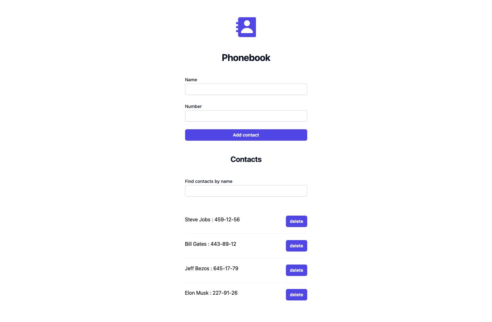

# Критерії приймання

- При здачі домашньої роботи є посилання: на вихідні файли та робочу сторінку
  проекту на `GitHub Pages`.
- Під час запуску коду завдання в консолі відсутні помилки та попередження.
- Для кожного компонента є окрема папка з файлом React-компонента та файлом
  стилів
- Імена компонентів зрозумілі та описові.

## Книга контактів

- Створений репозиторій `goit-react-woolf-hw-04-phonebook`.
- Проведи рефакторинг коду завдання, використовуючи React-хуки.

### Фінальний результат

